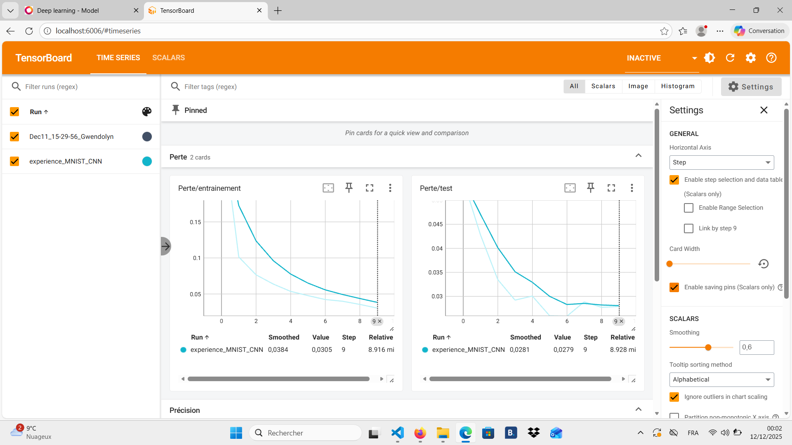
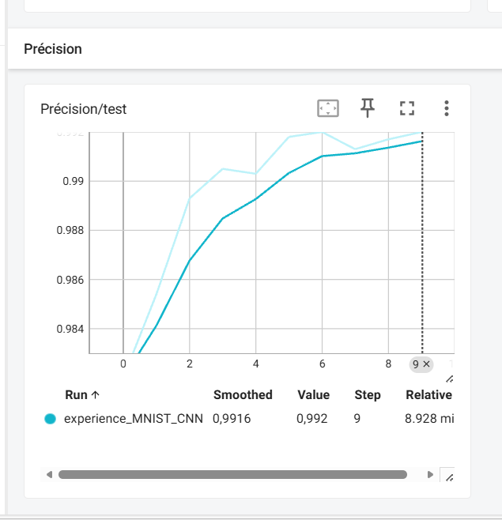

# Cours_IA

Alors avant tout, je suis désolé...
voila, j'ai essayé, est ce que ça a abouti un modèle intelligent qui sais différencier les chiffres ? ... pas vraiment MAIS bon

## Déploiement
**URL de déploiement du Frontend:** [https://cours-ia.vercel.app/](https://cours-ia.vercel.app/)

## TensorBoard
Ci-dessous une représentation des pertes et de la précision de la machine en image.

